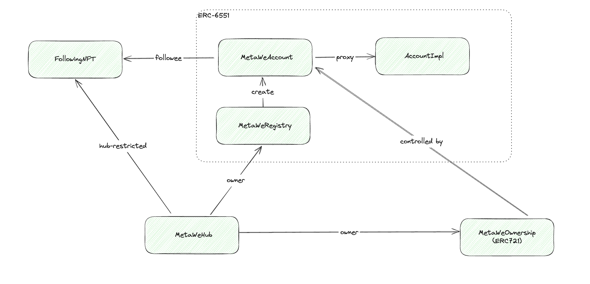

## MetaWe

> This is my pet-project to practice some Solidity coding and testing: an attempt to create social network smart-contract protocol from scratch.
> I will describe every new feature or contract in this readme file.

### Initial architecture scheme

### Features implemented

1. Account creation (minting ownership and deploy of the ERC-6551 account)
2. Following mechanism (using ERC721 contract for every specific account, where minting equal following to special account).
